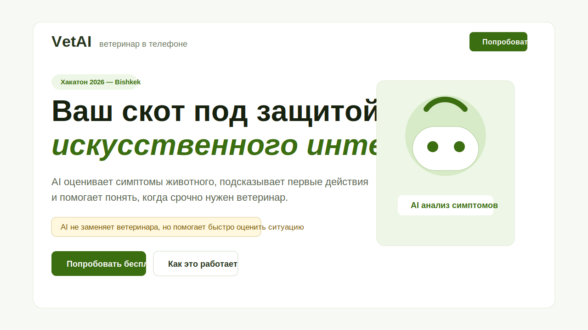
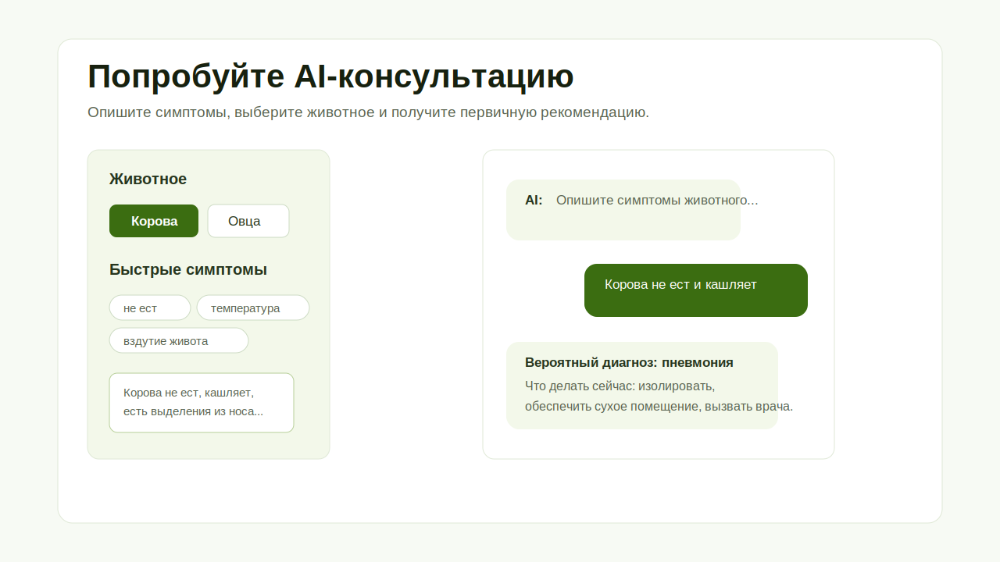
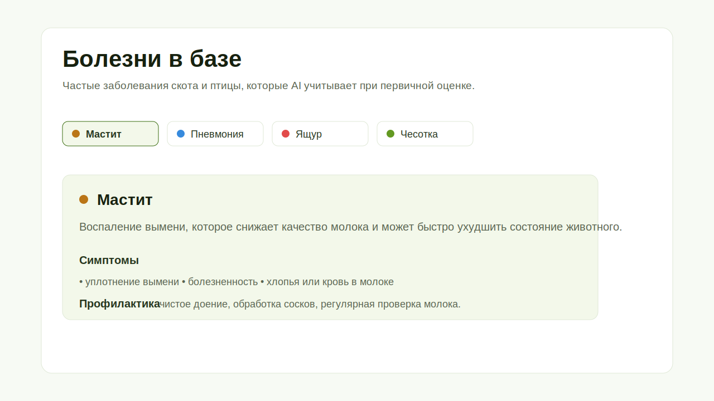

# VetAI

VetAI — веб-приложение для фермеров в отдалённых районах Кыргызстана. Пользователь выбирает животное, описывает симптомы или прикрепляет фото, а AI даёт первичную оценку состояния, список срочных действий и признаки, при которых нужно вызывать ветеринара. Интерфейс и AI-ответы доступны на русском и кыргызском языках.

Демо: https://ferm-rho.vercel.app

## Проблема

У фермеров в регионах часто нет быстрого доступа к ветеринару: до ближайшей клиники может быть далеко, болезнь развивается быстро, а первые часы критичны для стада. Из-за этого фермеру сложно понять, это обычное расстройство, инфекция или случай, где нужна срочная изоляция и вызов специалиста.

VetAI закрывает этот разрыв: помогает структурировать симптомы, получить понятную первичную рекомендацию на русском языке и быстрее принять решение. Приложение не заменяет ветеринара и явно предупреждает об этом в интерфейсе.

## Что Смотреть Жюри

1. Главный экран: объясняет ценность продукта и ведёт в демо.
2. Переключатель RU/KG в шапке: меняет интерфейс, подсказки и язык AI-консультации.
3. Демо-чаты: выбор животного, быстрые симптомы, фото животного, история консультаций.
4. База болезней: интерактивные карточки с симптомами и профилактикой.
5. Серверный AI-прокси: LLM API-ключ не попадает в клиентский JavaScript.

## Скриншоты







## Стек

- React
- Vite
- Tailwind CSS через `@tailwindcss/vite`
- Zustand для состояния чата и локальной истории
- Собственный словарь локализации RU/KG
- Vercel Static Hosting + Vercel Edge Function `/api/chat`
- Groq Chat Completions API для AI-ответов
- Google Maps JavaScript API для карты ветеринаров

## Архитектура AI

Фронтенд отправляет сообщения только на внутренний endpoint:

```text
React UI -> /api/chat -> Groq API
```

`GROQ_API_KEY` хранится только на серверной стороне в переменных окружения Vercel. Клиентский bundle не содержит LLM-ключ, поэтому его нельзя украсть через DevTools. Выбранный язык (`ru` или `ky`) отправляется в `/api/chat`, а сервер выбирает соответствующий system prompt.

Для контроля расхода токенов чат отправляет в модель только последние 6 сообщений контекста, не сохраняет image payload в историю и ограничивает длину ответа.

## Локальный Запуск

```bash
npm install
cp .env.example .env
npm run dev
```

Для полной проверки AI-запросов локально нужен Vercel dev server, потому что `/api/chat` — serverless function:

```bash
npx vercel dev
```

Переменные окружения:

```bash
GROQ_API_KEY=...
VITE_GOOGLE_MAPS_API_KEY=...
```

## Деплой

Проект рассчитан на Vercel.

```bash
npx vercel deploy --prod
```

В Vercel Project Settings нужно добавить:

- `GROQ_API_KEY` — server-side ключ для `/api/chat`
- `VITE_GOOGLE_MAPS_API_KEY` — browser key для карты, желательно ограниченный доменом
